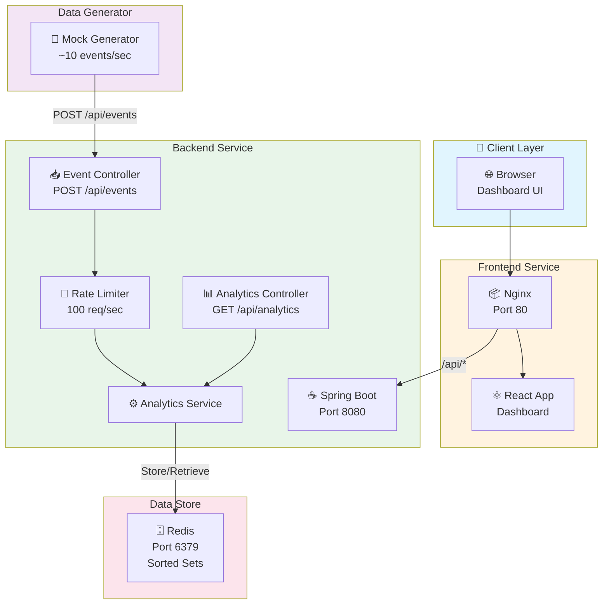
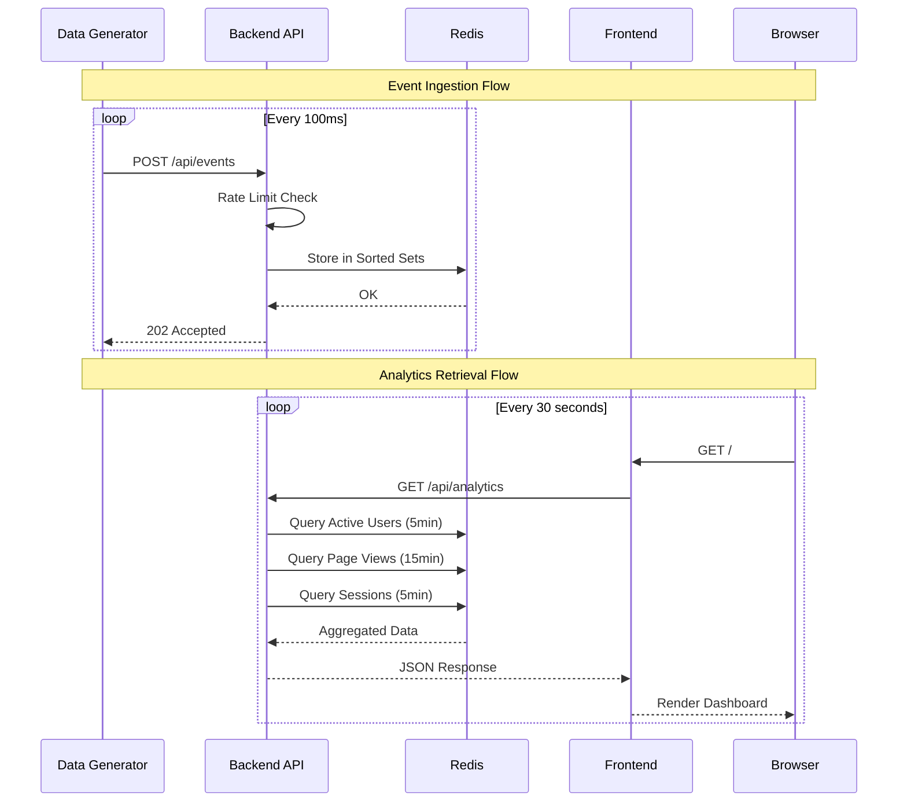

# E-commerce Real-time Analytics Platform

A production-ready analytics service that processes user events and provides real-time insights for e-commerce platforms.

## 📋 Table of Contents

- [Features](#features)
- [Architecture Overview](#architecture-overview)
- [Setup Instructions](#setup-instructions)
- [API Documentation](#api-documentation)
- [Project Structure](#project-structure)
- [Configuration](#configuration)
- [Testing](#testing)

---

## ✨ Features

- **Event Ingestion**: Accept JSON events with validation and rate limiting (100 events/second)
- **Real-Time Processing**: Calculate rolling metrics using Redis
  - Active users (last 5 minutes)
  - Page views by URL (last 15 minutes)
  - Active sessions per user (last 5 minutes)
- **Dashboard**: Single-page React dashboard with auto-refresh (30 seconds)
- **Mock Data Generator**: Standalone utility generating random events

---

## 🏗 Architecture Overview

### System Architecture Diagram



### Component Interaction Diagram



### ASCII Diagram (for non-GitHub viewers)

```
┌─────────────────────────────────────────────────────────────────────────────┐
│                           E-commerce Analytics Platform                       │
└─────────────────────────────────────────────────────────────────────────────┘

                              ┌──────────────────┐
                              │  Data Generator  │
                              │   (Java App)     │
                              │  ~10 events/sec  │
                              └────────┬─────────┘
                                       │
                                       │ POST /api/events
                                       ▼
┌──────────────────────────────────────────────────────────────────────────────┐
│                              Backend Service                                  │
│                          (Spring Boot - Java 17)                             │
│  ┌─────────────────┐  ┌─────────────────┐  ┌─────────────────────────────┐  │
│  │ EventController │  │AnalyticsService │  │    Rate Limiter            │  │
│  │  POST /events   │──│  Process Event  │  │  (Bucket4j - 100 req/s)    │  │
│  │  GET /analytics │  │  Get Metrics    │  └─────────────────────────────┘  │
│  └─────────────────┘  └────────┬────────┘                                    │
│                                │                                              │
└────────────────────────────────┼──────────────────────────────────────────────┘
                                 │
                                 │ Store/Retrieve Metrics
                                 ▼
                      ┌─────────────────────┐
                      │       Redis         │
                      │   (Data Store)      │
                      │                     │
                      │  • Sorted Sets      │
                      │    (Time-based)     │
                      │  • Active Users     │
                      │  • Page Views       │
                      │  • Sessions         │
                      └─────────────────────┘
                                 ▲
                                 │ GET /api/analytics
                                 │
┌────────────────────────────────┴──────────────────────────────────────────────┐
│                              Frontend (React)                                 │
│  ┌─────────────────────────────────────────────────────────────────────────┐ │
│  │                        Analytics Dashboard                               │ │
│  │  ┌─────────────┐  ┌─────────────────┐  ┌───────────────────────────┐   │ │
│  │  │Active Users │  │   Top 5 Pages   │  │  Active Sessions/User     │   │ │
│  │  │  (5 min)    │  │    (15 min)     │  │      (5 min)              │   │ │
│  │  └─────────────┘  └─────────────────┘  └───────────────────────────┘   │ │
│  │                                                                         │ │
│  │  Auto-refresh: 30 seconds    │    Pagination: 20 items/page            │ │
│  └─────────────────────────────────────────────────────────────────────────┘ │
│                              Nginx (Port 80)                                  │
└───────────────────────────────────────────────────────────────────────────────┘
```

### Component Diagram

```
┌─────────────────┐     ┌─────────────────┐     ┌─────────────────┐
│    Frontend     │────▶│    Backend      │────▶│     Redis       │
│  (React/Nginx)  │     │ (Spring Boot)   │     │   (Cache/DB)    │
│    Port: 80     │     │   Port: 8080    │     │   Port: 6379    │
└─────────────────┘     └─────────────────┘     └─────────────────┘
         ▲                       ▲
         │                       │
         │               ┌───────┴───────┐
         │               │ Data Generator│
         └───────────────│  (Java App)   │
           (Dashboard)   └───────────────┘
```

### Data Flow

1. **Event Ingestion**: Data Generator → Backend API → Redis (Sorted Sets)
2. **Metrics Retrieval**: Frontend → Backend API → Redis → Aggregated Response
3. **Rate Limiting**: Applied at ingestion endpoint (100 requests/second)

---

## 🚀 Setup Instructions

### Prerequisites

- **Docker** & **Docker Compose** 
- **Git** (for cloning the repository)

### Quick Start 


1. **Clone the repository**
   ```bash
   git clone <repository-url>
   cd test
   ```

2. **Build all Docker images** (first time only - takes ~2-5 minutes)
   ```bash
   docker-compose build
   ```
   
   This will:
   - Build the **backend** image (Maven + Spring Boot)
   - Build the **frontend** image (Node.js + React + Nginx)
   - Build the **data-generator** image (Maven + Java)
   - Pull **Redis** image from Docker Hub

3. **Start all services**
   ```bash
   docker-compose up -d
   ```

4. **Wait for services to start** (~10-15 seconds)
   ```bash
   # Check all containers are running
   docker-compose ps
   ```
   
   You should see 4 containers:
   - `test-redis-1` - Running
   - `test-backend-1` - Running
   - `test-frontend-1` - Running
   - `test-data-generator-1` - Running

5. **Access the dashboard**
   - Open your browser to: **http://localhost:80**
   - Data will start appearing within a few seconds

6. **View service logs** (optional)
   ```bash
   docker-compose logs -f
   ```

### One-Command Setup

For convenience, you can build and start everything in one command:

```bash
docker-compose up -d --build
```

### Service Ports

| Service | Port | Description |
|---------|------|-------------|
| Frontend | 80 | React Dashboard (Nginx) |
| Backend | 8080 | Spring Boot API |
| Redis | 6379 | Data Store |

### Stopping Services

```bash
docker-compose down
```

### Rebuilding After Changes

```bash
docker-compose build --no-cache
docker-compose up -d
```

---

## 📡 API Documentation

### Base URL
```
http://localhost:8080/api
```

### Endpoints

#### 1. Ingest Event

**POST** `/api/events`

Ingests a user event for analytics processing.

**Request Body:**
```json
{
  "timestamp": "2024-03-15T14:30:00Z",
  "user_id": "usr_789",
  "event_type": "page_view",
  "page_url": "/products/electronics",
  "session_id": "sess_456"
}
```

**Request Fields:**

| Field | Type | Required | Description |
|-------|------|----------|-------------|
| `timestamp` | string | Yes | ISO 8601 format (e.g., `2024-03-15T14:30:00Z`) |
| `user_id` | string | Yes | User identifier (format: `usr_XXX`) |
| `event_type` | string | Yes | Event type: `page_view`, `click`, `scroll`, `form_submit` |
| `page_url` | string | Yes | URL path of the page |
| `session_id` | string | Yes | Session identifier (format: `sess_XXX`) |

**Response:**

- **202 Accepted**: Event processed successfully
  ```json
  {
    "status": "accepted",
    "message": "Event processed successfully"
  }
  ```

- **400 Bad Request**: Invalid event data
  ```json
  {
    "error": "Validation failed",
    "details": ["user_id is required"]
  }
  ```

- **429 Too Many Requests**: Rate limit exceeded
  ```json
  {
    "error": "Rate limit exceeded",
    "retryAfter": 1
  }
  ```

**cURL Example:**
```bash
curl -X POST http://localhost:8080/api/events \
  -H "Content-Type: application/json" \
  -d '{
    "timestamp": "2024-03-15T14:30:00Z",
    "user_id": "usr_789",
    "event_type": "page_view",
    "page_url": "/products/electronics",
    "session_id": "sess_456"
  }'
```

---

#### 2. Get Analytics

**GET** `/api/analytics`

Retrieves current analytics metrics.

**Response:**
```json
{
  "activeUsers": 150,
  "topPages": [
    {"url": "/home", "views": 1250},
    {"url": "/products/electronics", "views": 890},
    {"url": "/deals", "views": 654},
    {"url": "/cart", "views": 432},
    {"url": "/checkout", "views": 321}
  ],
  "activeSessions": {
    "usr_123": 3,
    "usr_456": 2,
    "usr_789": 1
  }
}
```

**Response Fields:**

| Field | Type | Description |
|-------|------|-------------|
| `activeUsers` | integer | Count of unique users in last 5 minutes |
| `topPages` | array | Top 5 pages by views in last 15 minutes |
| `topPages[].url` | string | Page URL |
| `topPages[].views` | integer | Number of page views |
| `activeSessions` | object | Map of user_id to session count (last 5 minutes) |

**cURL Example:**
```bash
curl http://localhost:8080/api/analytics
```

---

### Rate Limiting

- **Limit**: 100 requests per second
- **Scope**: Applied to POST `/api/events` endpoint
- **Response**: HTTP 429 when limit exceeded

---

## 📁 Project Structure

```
test/
├── docker-compose.yml          # Container orchestration
├── README.md                   # This file
│
├── backend/                    # Spring Boot Backend
│   ├── Dockerfile
│   ├── pom.xml
│   └── src/main/java/com/example/analyticsservice/
│       ├── AnalyticsServiceApplication.java
│       ├── config/
│       │   ├── RateLimitConfig.java      # Bucket4j rate limiting
│       │   ├── WebConfig.java            # CORS configuration
│       │   └── GlobalExceptionHandler.java
│       ├── controller/
│       │   ├── EventController.java      # POST /api/events
│       │   └── AnalyticsController.java  # GET /api/analytics
│       ├── dto/
│       │   ├── AnalyticsDto.java
│       │   └── PageView.java
│       ├── model/
│       │   └── Event.java
│       └── service/
│           ├── AnalyticsService.java
│           └── impl/
│               └── AnalyticsServiceImpl.java
│
├── frontend/                   # React Frontend
│   ├── Dockerfile
│   ├── nginx.conf              # Nginx proxy configuration
│   ├── package.json
│   └── src/
│       ├── App.js              # Main dashboard component
│       ├── App.css             # Styling
│       └── index.js
│
└── data-generator/             # Mock Data Generator
    ├── Dockerfile
    ├── pom.xml
    └── src/main/java/com/example/datagenerator/
        └── DataGenerator.java
```

---

## ⚙️ Configuration

### Backend (application.properties)

```properties
server.port=8080
spring.data.redis.host=${SPRING_DATA_REDIS_HOST:localhost}
spring.data.redis.port=6379
```

### Environment Variables

| Variable | Default | Description |
|----------|---------|-------------|
| `SPRING_DATA_REDIS_HOST` | `localhost` | Redis host address |
| `INGESTION_API_URL` | `http://localhost:8080/api/events` | Data generator target URL |

---

## 🧪 Testing

### Running Unit Tests

```bash
cd backend
mvn test
```

### Manual API Testing

```bash
# Ingest an event
curl -X POST http://localhost:8080/api/events \
  -H "Content-Type: application/json" \
  -d '{"timestamp":"2024-03-15T14:30:00Z","user_id":"usr_123","event_type":"page_view","page_url":"/test","session_id":"sess_456"}'

# Get analytics
curl http://localhost:8080/api/analytics
```

### Load Testing

```bash
# Using Apache Bench (100 requests, 10 concurrent)
ab -n 100 -c 10 -p event.json -T application/json http://localhost:8080/api/events
```

---
